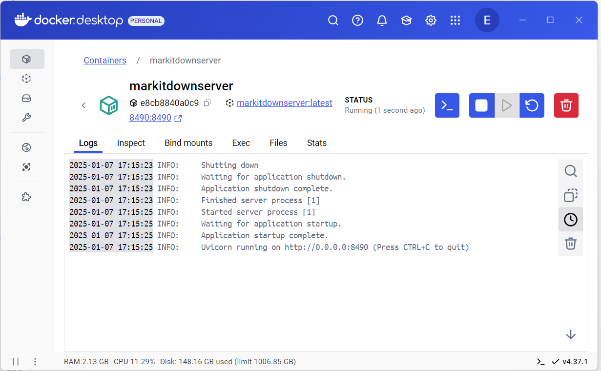
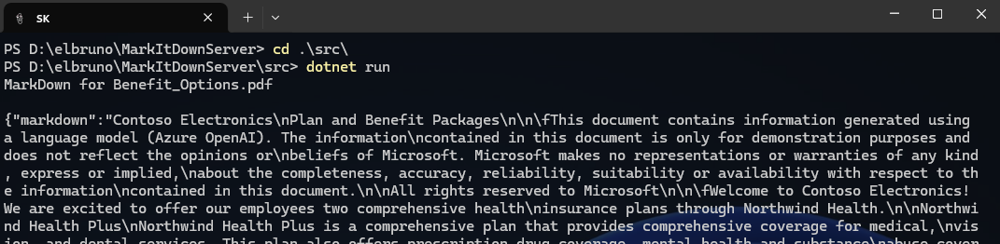

# MarkItDown Web Server

This project is a simple web server application built using FastAPI that receives binary data from a file, converts it to Markdown format using the MarkItDown library, and returns the Markdown content.


## Setup Instructions

1. Clone the repository:
   ```bash
   git clone <repository-url>   
   ```

1. Navigate to the project directory:
   ```bash
   cd <the folder where you cloned the repo>
   ```

1. Build the docker image
   ```bash
   docker build -t markitdownserver .
   ```

1. Run the docker container
   ```bash
   docker run -d --name markitdownserver -p 80:80 markitdownserver
   ```

1. The docker container should be visible in docker.

	

## Usage

1. Navigate to the C# Console application directory.

   ```bash
   cd ./src/
   ```

1. Run the .Net application

   ```bash
   dotnet run
   ```

1. The dotnet app should send a sample document to the web server and receive the markdown content.

	

## Dependencies

- FastAPI
- MarkItDown

## License

This project is licensed under the MIT License.